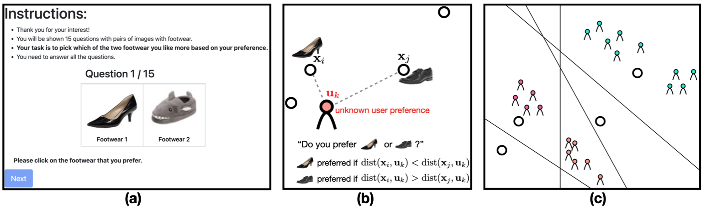

# Learning Population of Preferences via Pairwise Comparison Queries

This repository provides code for the simulations and experiments in our paper: [Leanring Populations of Preferences via
Pairwise Comparison Queries](https://ramyakv.github.io/Learning_Populations_of_Preferemces_2024.pdf). It also contains a dataset we collected on Amazon Mechanical Turk, a real crowdsourcing platform.

## Usage

1. Run `generate_items.py` to generate items to be used.
    - This will out put a file with name `*.item`. You can place it into a directory called `/items` so that they can be
      used by `generate_users.py`
2. Run `generate_users.py` to generate users to be used.
    - This will out put a file with name `*.user`. You can place it into a directory called `/users` so that they can be
      used by `generate_our_results.py` or `generate_lu_results.py`
3. Run `generate_our_results.py` to generate probability masses using our method.
4. Run `generate_lu_results.py` to generate probability masses using Lu and Boutilier.
5. Run notebooks in `plotting` directory to generate figures shown in the paper.

Command line arguments for python scripts can be found in their corresponding source code.

## Dataset

### Zappos5

We pick 5 shoes as our query item set from [UT Zappos50K](https://vision.cs.utexas.edu/projects/finegrained/utzap50k/):

We posted pairwise comparison task on Amazon Mechanical Turk. Each task involves 15 pairwise comparison queries (10
unique pairs and 5 repeated pairs). The median time taken per query is around 2.58s and for the task (15 pair
comparisons) is ∼ 47s. Each worker is paid 15 cents per task. This is roughly ∼ $7 per hour. We did not restrict the
task to the master workers. The task was open to all those who had at least 500 HITs approved and 95% approval rate.

The parquet file `dataset/zappos_6000.parquet` contains the results obtained from crowdworkers. This dataset has 4
columns:
1. `left`: the shoe (id) shown on the left
2. `right`: the shoe (id) shown on the right
3. `answer`: 0 if the crowdworker prefers the shoe on the left, 1 otherwise
4. `worker_id`: crowdworker's identifier
5. `answer_id`: pairwise comparison id

### DCEU

A dataset involves 12 DC superhero movies. We crawled both movie critics' and average audiences' review from RottenTomato for the 12 movies. The file `dataset/dceu.csv` contains the list of movies. The file
`dataset/dceu_rotten_review.parquet` contains 4 columns:
1. `reviewer`: reviewer's name
2. `reviewer_type`: whether the reviewer is a critic or average audience
3. `score`: score of the movie
4. `title`: title of the movie

### Movie2

A dataset involves 7 movies from US, China, and South Korea. We crawled both movie critics' and average audiences' review from RottenTomato for the 7 movies. The file `dataset/movie2.csv` contains the list of movies. The file
`dataset/movie2_rotten_review.parquet` contains 4 columns:
1. `reviewer`: reviewer's name
2. `reviewer_type`: whether the reviewer is a critic or average audience
3. `score`: score of the movie
4. `title`: title of the movie